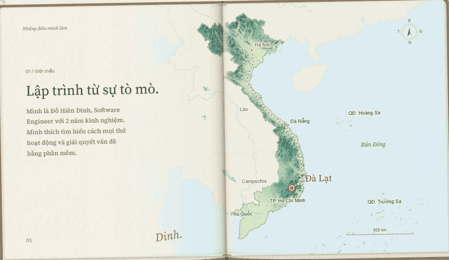

<p align="center">
  
</p>

# MyPortfolio

Portfolio cá nhân của **Đỗ Hiền Dinh**, Software Engineer tại Đà Lạt. Một cuốn sổ mở, bản đồ Việt Nam và hành trình cuộn dần tới Đà Lạt.

**[Xem website](http://113.161.254.76:18088/)** · **[GitHub profile](https://github.com/cattfan)** · **[Liên hệ](mailto:dohiendinh.work@gmail.com)**

<a href="http://113.161.254.76:18088/">
  <picture>
    <source media="(prefers-reduced-motion: reduce)" srcset="docs/github-profile/assets/portfolio.png" />
    
  </picture>
</a>

## Trải nghiệm

- Bản đồ có địa hình, đường đi và các mức chi tiết cùng một phép chiếu; hiệu ứng zoom chạy theo cuộn trang.
- Nội dung VI/EN, mặc định tiếng Việt và nhớ lựa chọn của người xem.
- Hai dự án với ảnh tự chuyển sau 5 giây; mở chi tiết không đẩy nội dung bên dưới.
- Header cố định, sao chép email/số điện thoại, hỗ trợ bàn phím và giảm chuyển động.
- Bản production xuất tĩnh, phục vụ bằng Nginx trong Docker, kèm CSP và các header bảo mật.

## Công nghệ

Next.js · React · TypeScript · Tailwind CSS · Motion · d3-geo · Sharp · Playwright · Docker · Nginx

## Chạy tại máy

Cần Node.js 24+ và pnpm 11.25.0.

```sh
pnpm install --frozen-lockfile
pnpm --filter web dev
```

Mở `http://localhost:3000`.

```sh
pnpm --filter web lint
pnpm --filter web check-types
pnpm --filter web build
pnpm --filter web exec playwright install chromium
pnpm --filter web test:e2e
```

Kiểm thử trình duyệt cần website đang chạy. Đặt `PORTFOLIO_URL` để dùng địa chỉ khác; `PLAYWRIGHT_CHROMIUM_EXECUTABLE` để dùng Chromium đã cài.

## Docker

```sh
docker compose build
docker compose up -d
```

Mặc định mở `http://localhost:18088`. Xem [hướng dẫn triển khai](deploy/README.md) và [báo cáo rà soát bảo mật](deploy/SECURITY_REVIEW.md).

## Cấu trúc

| Thư mục               | Nội dung                                                                       |
| --------------------- | ------------------------------------------------------------------------------ |
| `apps/web`            | Ứng dụng portfolio, nội dung, component, assets và kiểm thử                    |
| `packages`            | Cấu hình dùng chung trong workspace                                            |
| `deploy`              | Nginx, hướng dẫn Docker, ghi nhận triển khai và rollback                       |
| `scripts/capture`     | Công cụ chuẩn bị ảnh dự án và ảnh động giới thiệu                              |
| `docs/github-profile` | README và assets cho trang cá nhân GitHub                                      |
| `apps/docs`           | Ứng dụng tài liệu mẫu của workspace, không dùng trong bản portfolio production |

Sửa nội dung tiếng Việt tại [`portfolio.ts`](apps/web/content/portfolio.ts), tiếng Anh tại [`translations.ts`](apps/web/content/translations.ts). Chi tiết về bản đồ và hiệu ứng nằm trong [tài liệu ứng dụng](apps/web/README.md).

Mã nguồn ở đây là **website portfolio**. Các sản phẩm được giới thiệu có mã nguồn riêng. Nguồn và giấy phép bản đồ, ảnh tham khảo, font được ghi trong metadata/tệp license đi kèm; chúng không mặc nhiên thuộc cùng một giấy phép với mã nguồn.

---

**Đỗ Hiền Dinh** · [dohiendinh.work@gmail.com](mailto:dohiendinh.work@gmail.com) · +84 964 173 913
